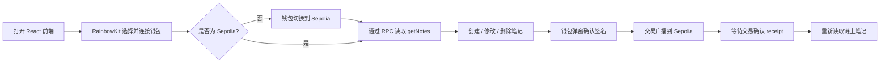

<div align="center">

# ✦ Chain Notebook

### 我的第一个链上记事本 DApp

把想法写进区块链，用一个完整的小项目理解合约、钱包、交易与前端交互。

[](https://soliditylang.org/)
[](https://react.dev/)
[](https://sepolia.etherscan.io/)
[](./contract/contracts/ChainNotebook.sol)

[在线合约](https://sepolia.etherscan.io/address/0x3f6006B248AC4e053de2c6AFAF4eb0fb0eAE816D) · [开始学习](#-从这里开始) · [理解钱包连接](#-walletconnect-是什么)

</div>

---

## ✨ 你会学到什么

这个项目没有传统后端：**智能合约就是链上后端**。你将跑通一次完整的 DApp 闭环：

1. 用 Solidity 编写并测试合约；
2. 通过 Hardhat 部署到 Sepolia 测试网；
3. 用 React 做界面，wagmi + viem 调用合约；
4. 用 RainbowKit / WalletConnect 连接用户钱包；
5. 让用户签名交易，再从链上同步最新数据。

> 区块链数据是公开的。这里适合记录学习笔记，不要写入密码、助记词或任何隐私信息。

## 📍 当前状态

| 项目部分 | 状态 | 说明 |
| --- | --- | --- |
| Solidity 合约 | 已部署 | 部署在 Ethereum Sepolia 测试网 |
| 合约地址 | 已配置 | `0x3f60...816D`，完整地址见上方链接 |
| 前端 | 可本地运行 | 连接钱包后可创建、修改、删除笔记 |
| GitHub 源码 | 已发布 | [Leon4868/chain-notebook](https://github.com/Leon4868/chain-notebook) |
| Etherscan 源码验证 | 可选 | 不影响使用，只影响浏览器中能否直接查看源码 |
| 公网前端网址 | 未配置 | 如需分享给别人，再部署到 Vercel、Netlify 或 GitHub Pages |

## 🧭 整体流程



把它类比成线上银行：

| Web3 部分 | 类比 | 在本项目中的职责 |
| --- | --- | --- |
| 钱包 | 你的银行卡 + 签名器 | 证明“这是你”，并确认每笔写入交易 |
| 智能合约 | 不可随意篡改的公共账本规则 | 保存笔记，限制只能改自己的笔记 |
| RPC | 访问银行系统的网络窗口 | 把前端和 Hardhat 连接到 Sepolia 节点 |
| WalletConnect | 网页与手机钱包的通信桥 | 支持扫码连接手机钱包 |
| Etherscan | 区块链的交易查询网站 | 查看合约地址、交易和验证后的源码 |

## 🔐 需要准备的资料，到底用来做什么？

### 现在已经能操作，还需要给我什么？

**不需要再发送任何敏感资料。** 当前合约已经部署，前端能使用。以下配置只应由你写在本机，不要把私钥、密码或含密钥的 URL 发到聊天里，也不要提交进 Git。

| 资料 | 谁在使用 | 用途 | 现在是否仍需要 |
| --- | --- | --- | --- |
| `SEPOLIA_PRIVATE_KEY` | Hardhat 部署端 | 对“部署合约”这笔交易签名并支付部署 gas | 合约已部署，前端操作不再使用它 |
| `SEPOLIA_RPC_URL` | Hardhat 部署端 | 让 Hardhat 访问 Sepolia、发送部署或验证请求 | 仅重新部署 / 验证时需要 |
| `ETHERSCAN_API_KEY` | Hardhat 验证端 | 把合约源码提交到 Etherscan 验证 | 可选，不影响 DApp 使用 |
| `VITE_SEPOLIA_RPC_URL` | 浏览器前端 | 读取合约数据，例如 `getNotes` | 建议配置，保证读取稳定 |
| `VITE_NOTEBOOK_ADDRESS` | 浏览器前端 | 定位要调用的 ChainNotebook 合约 | 必须配置，当前为已部署地址 |
| `VITE_WALLETCONNECT_PROJECT_ID` | RainbowKit / WalletConnect | 允许网页连接 WalletConnect 支持的钱包 | 需要配置以支持手机钱包连接 |
| Sepolia 测试 ETH | 每位写入用户的钱包 | 支付创建、修改、删除笔记的测试 gas | 写入时需要；只读不需要 |

### ✦ WalletConnect 是什么？

RainbowKit 是页面上的“钱包选择器”，而 **WalletConnect 是网页和手机钱包之间的通信协议**。当用户在电脑网页上选择 WalletConnect 时，通常会看到二维码；手机钱包扫码后，用户仍然在自己的钱包中确认交易。

`Project ID` 可以理解为这个 DApp 在 WalletConnect Cloud 的“应用编号”：

- 它不是钱包私钥，不能转走资产，也不能替用户签名；
- 它在浏览器中可见，因此不能当作机密；
- 仍建议在 [WalletConnect Dashboard](https://dashboard.walletconnect.com/) 配置允许访问的域名和用量限制；
- 当前代码把它传给 RainbowKit 的 `getDefaultConfig`，用于生成钱包连接器。

前端实际读取的位置：[`frontend/src/config.ts`](./frontend/src/config.ts)。RainbowKit 官方也要求使用 WalletConnect 的 DApp 配置一个 `projectId`：[官方安装文档](https://rainbowkit.com/en-US/docs/installation)。

> MetaMask 浏览器扩展可以直接注入连接；但要稳定支持移动钱包和 WalletConnect 生态，仍应使用真实的 Project ID。

### 两个 RPC URL 为什么看起来重复？

它们都可以指向 Sepolia，但运行场景不同：

- `SEPOLIA_RPC_URL`：仅给 **Hardhat** 用，放在加密 keystore；
- `VITE_SEPOLIA_RPC_URL`：给 **浏览器前端** 用，Vite 会打包进网页。

因此，前端使用的 RPC 如果带服务商 Key，应当视为公开的客户端凭据：使用单独的、限额/限域名的 Key，绝不要把私钥放进任何 `VITE_*` 变量。

## 🏗️ 项目结构

```text
chain-notebook/
├── contract/                         # Hardhat 3 + Solidity
│   ├── contracts/ChainNotebook.sol   # 链上记事本规则与数据
│   ├── test/ChainNotebook.ts          # 合约测试
│   └── ignition/modules/              # 部署模块
└── frontend/                         # Vite + React + TypeScript
    └── src/
        ├── config.ts                 # Sepolia、RPC、钱包连接配置
        ├── contract.ts               # ABI 和前端数据类型
        └── App.tsx                   # 读取、写入、等待确认、刷新数据
```

## 🚀 从这里开始

### 1. 安装依赖并通过本地检查

```bash
cd contract
npm install
npm test
npm run deploy:local

cd ../frontend
npm install
npm run typecheck
npm run build
npm run lint
```

本地 Hardhat 网络是一次性的模拟链，适合练习合约逻辑；重启后数据会消失，且不需要测试 ETH。

### 2. 配置前端并启动

```bash
cd frontend
cp .env.example .env
npm run dev
```

编辑 `frontend/.env`：

```dotenv
VITE_WALLETCONNECT_PROJECT_ID=你的_WalletConnect_Project_ID
VITE_SEPOLIA_RPC_URL=你的_前端_Sepolia_RPC_URL
VITE_NOTEBOOK_ADDRESS=0x3f6006B248AC4e053de2c6AFAF4eb0fb0eAE816D
```

然后打开 Vite 显示的本地地址，连接钱包并切换到 **Ethereum Sepolia**。

### 3. 读与写的差别

| 操作 | 合约方法 | 是否弹钱包 | 是否花 gas |
| --- | --- | --- | --- |
| 查看自己的笔记 | `getNotes(address)` | 否 | 否 |
| 新建笔记 | `createNote(string)` | 是 | 是，花 Sepolia 测试 ETH |
| 修改笔记 | `updateNote(uint256, string)` | 是 | 是，花 Sepolia 测试 ETH |
| 删除笔记 | `deleteNote(uint256)` | 是 | 是，花 Sepolia 测试 ETH |

前端会在交易确认后自动重新读取笔记。核心实现见 [`frontend/src/App.tsx`](./frontend/src/App.tsx)。

## ⛓️ 合约规则

```solidity
createNote(string content)
getNotes(address owner)
updateNote(uint256 noteId, string content)
deleteNote(uint256 noteId)
```

- 每个钱包地址拥有自己的笔记列表；
- 只有创建者可以修改或删除自己的笔记；
- 内容不能为空，按 **bytes** 计算最多 500；
- 删除是软删除：前端不再展示，但历史链上数据不会被真正抹除；
- 所有地址的链上数据都可被读取。

## 🛠️ 重新部署或验证源码（可选）

仅当你想重新部署合约，或在 Etherscan 验证源码时使用。把配置写入 Hardhat 加密 keystore，不要直接写进代码：

```bash
cd contract
npx hardhat keystore set SEPOLIA_RPC_URL
npx hardhat keystore set SEPOLIA_PRIVATE_KEY
npx hardhat keystore set ETHERSCAN_API_KEY

npm run deploy:sepolia
npm run verify:sepolia -- <部署后的合约地址>
```

部署成功后，将新的合约地址更新到 `frontend/.env` 的 `VITE_NOTEBOOK_ADDRESS`，再重启前端。

## ✅ 手动验收清单

- [ ] 钱包能连接，并显示当前地址；
- [ ] 非 Sepolia 网络时，能切换到 Sepolia；
- [ ] 能创建一条笔记并在 Etherscan 看到交易；
- [ ] 刷新网页后，笔记仍然存在；
- [ ] 能修改自己的笔记；
- [ ] 能删除自己的笔记；
- [ ] 切换到另一钱包后，不能修改原钱包的笔记。

## 🛡️ 安全边界

- 只使用 Sepolia 测试钱包；不要用主网私钥。
- 私钥、助记词、keystore 密码绝不能发送、粘贴或提交到 Git。
- `.env` 不应提交；仓库只保留 `.env.example`。
- `VITE_*` 会暴露到浏览器，因此只能放公开配置，不能放私钥。
- 不要把私人内容写进链上；“删除”不等于抹掉历史。

---

<div align="center">

**学习顺序建议：先读合约 → 跑测试 → 本地部署 → Sepolia 部署 → 连接钱包 → 观察交易。**

Made for learning Web3, one signed transaction at a time. ✦

</div>
